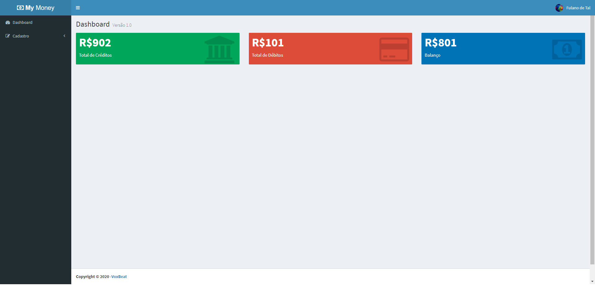
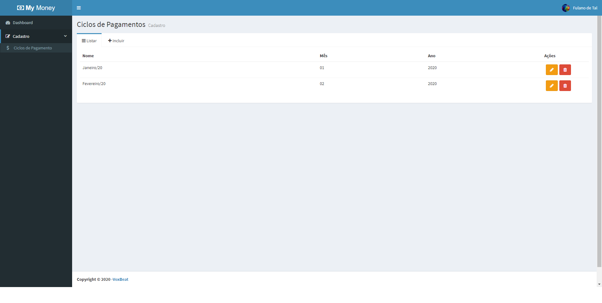
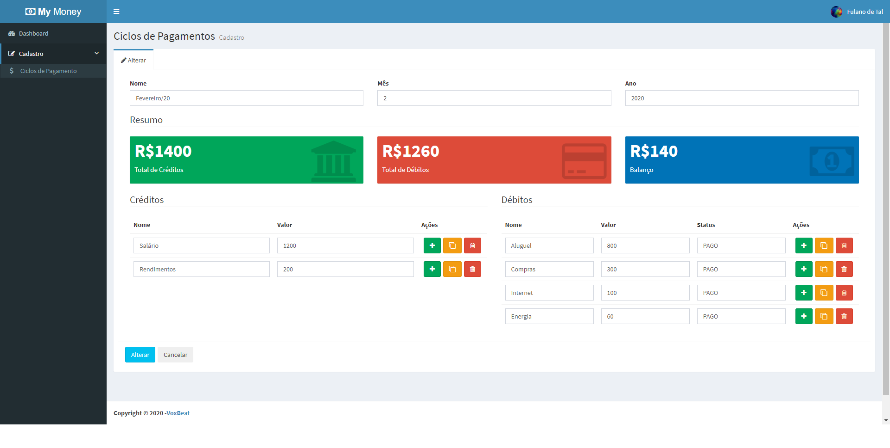
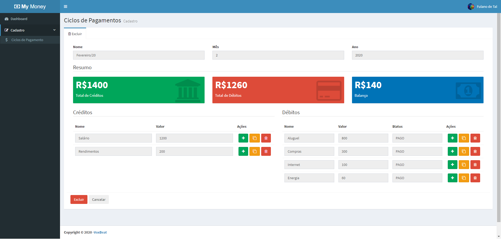

<h1 align="center">
     My Money App 
    Node.js | React
</h1>

## Featured Images

     
     
     
     
     

## Technologies

-  [Node.js](https://nodejs.org/en/)
-  [React](https://reactjs.org/)
-  [Redux](https://redux.js.org/)
-  [Express](https://expressjs.com/)
-  [axios](https://github.com/axios/axios)
-  [JTW](https://jwt.io/)
-  [MongoDB](https://www.mongodb.com/)
-  [PM2](https://pm2.keymetrics.io/)

---
Project developed in [Cod3r](https://www.cod3r.com.br/) classes.